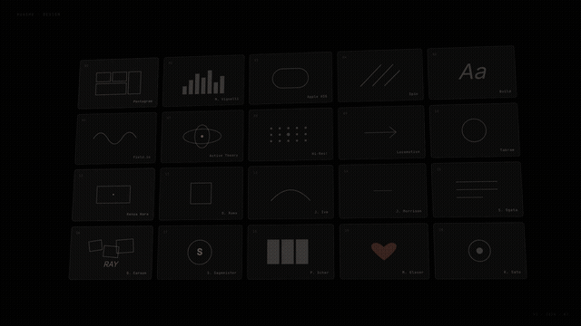
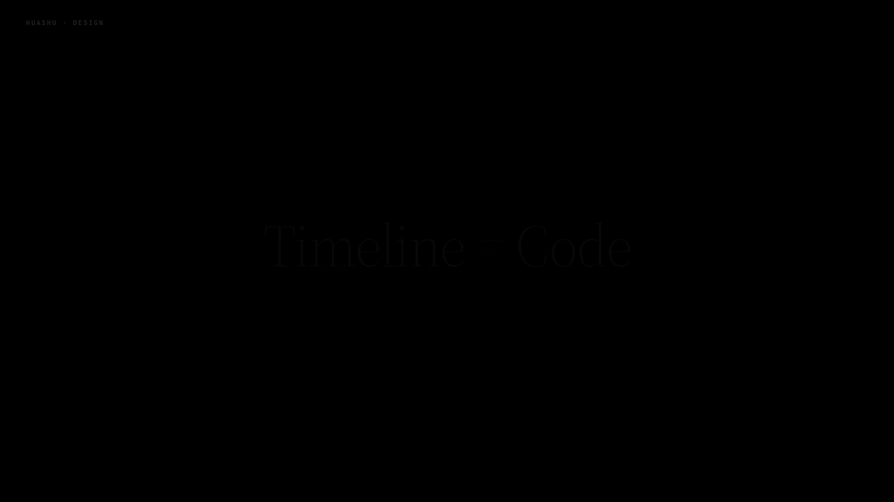
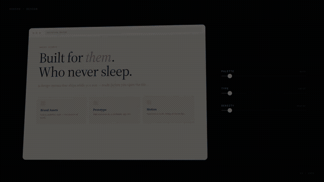

<sub>🌐 <a href="README.md">English</a> · <a href="README.zh-CN.md">中文</a> · <b>Français</b> · <a href="README.de.md">Deutsch</a> · <a href="README.ru.md">Русский</a> · <a href="README.ja.md">日本語</a> · <a href="README.it.md">Italiano</a> · <a href="README.es.md">Español</a></sub>

<div align="center">

# MyClaw Design

> *« Tapez. Appuyez sur Entrée. Un design fini atterrit sur vos genoux. »*

[](https://myclaw.ai)
[](https://github.com/openclaw/openclaw)
[](LICENSE)

<br>

**Dites une phrase à votre agent. Recevez un design livrable.**

3 à 30 minutes — livrez une **animation de lancement produit**, un prototype d'application cliquable, un jeu de diapositives modifiable ou une infographie prête à imprimer. Pas un rendu « généré par IA » — le genre de travail qui semble venir d'une vraie équipe de design.

Fournissez au skill vos assets de marque (logo, palette, captures d'écran UI) et il lira l'ADN de votre marque. Ne fournissez rien, et 20 philosophies de design intégrées garderont le résultat loin du slop IA.

</div>

---

<p align="center">
  <a href="https://github.com/LeoYeAI/myclaw-design/releases/download/v1.0.0/hero-animation-v10-en.gif"></a>
</p>

<p align="center"><sub>
  ▲ 25s · Terminal → 4 directions → Ondulation galerie → 4× Focus → Révélation de marque<br>
  👉 <a href="https://github.com/LeoYeAI/myclaw-design/releases/download/v1.0.0/hero-animation-v10-en.mp4">Télécharger MP4 avec BGM + SFX (10 Mo)</a>
</sub></p>

---

## Installation

```bash
# Copiez dans votre répertoire de skills OpenClaw
git clone https://github.com/LeoYeAI/myclaw-design.git ~/.openclaw/skills/myclaw-design
```

Ensuite, parlez simplement à votre agent :

```
"Crée une animation de lancement produit pour notre nouvelle fonctionnalité, propose 3 directions de style"
"Fais un prototype iOS cliquable — 4 écrans principaux avec navigation réelle"
"Crée un jeu de diapositives 1920×1080, exporte en PPTX modifiable"
"Transforme cette logique en motion graphic de 60 secondes, exporte MP4 et GIF"
"Lance une revue experte à 5 dimensions sur ce design"
```

Pas de boutons. Pas de panneaux. Pas de plugins Figma. Juste la conversation.

---

## Ce qu'il peut faire

| Capacité | Livrable | Temps typique |
|---|---|---|
| **Prototypes interactifs** (App / Web) | HTML fichier unique · Vrai cadre iPhone · Cliquable · Vérifié par Playwright | 10–15 min |
| **Jeux de diapositives** | Deck HTML (présentation navigateur) + PPTX modifiable (zones de texte préservées) | 15–25 min |
| **Animations timeline** | MP4 (25fps / 60fps interpolé) + GIF (palette optimisée) + BGM + SFX | 8–12 min |
| **Variantes de design** | 3+ comparaisons côte à côte · Tweaks en direct · Exploration multi-dimensions | 10 min |
| **Infographies** | Mise en page prête à imprimer · Export PDF/PNG/SVG | 10 min |
| **Conseiller en direction de design** | 5 écoles × 20 philosophies · 3 recommandations · Génération de démos en parallèle | 5 min |
| **Revue experte à 5 dimensions** | Graphique radar + Garder/Corriger/Gains rapides · Liste de corrections actionnables | 3 min |

---

## Galerie de démos

### Conseiller en direction de design

Quand les exigences sont vagues, le skill choisit 3 directions différenciées parmi 5 écoles × 20 philosophies de design, génère des démos en parallèle et vous laisse choisir.

<p align="center"></p>

### Prototype d'application iOS

Cadre précis iPhone 15 Pro (Dynamic Island / barre d'état / Home Indicator) · Navigation multi-écrans pilotée par état · Images réelles de Wikimedia/Met/Unsplash · Tests auto-clic Playwright avant livraison.

<p align="center"></p>

### Moteur de motion design

Modèle timeline Stage + Sprite · `useTime` / `useSprite` / `interpolate` / `Easing` — quatre API couvrent tous les besoins d'animation. Une commande exporte MP4 / GIF / 60fps interpolé / montage final avec BGM + SFX.

<p align="center"></p>

### Jeux de diapositives + PPTX modifiable

Diapositives HTML-first avec mise à l'échelle automatique, navigation clavier et notes du présentateur. Export en PPTX modifiable avec zones de texte natives — pas des captures d'écran collées sur des slides.

<p align="center"></p>

### Tweaks en direct

Ajustement de paramètres en temps réel — changez les palettes de couleurs, mises en page, typographies et densités sans régénérer. Les modifications persistent via localStorage.

<p align="center"></p>

### Infographies

Mises en page pilotées par les données, prêtes à imprimer, avec typographie précise. Export en PDF/PNG/SVG.

<p align="center"></p>

### Revue experte à 5 dimensions

Cohérence philosophique / Hiérarchie visuelle / Exécution des détails / Fonctionnalité / Innovation — chaque critère noté de 0 à 10 avec graphique radar, liste Garder, liste Corriger (classée par sévérité) et Gains rapides.

<p align="center"></p>

---

## Comment ça fonctionne

### Protocole d'assets de marque

Le skill ne devine pas votre marque. Il suit un protocole strict en 5 étapes :

1. **Demander** — Demande le logo, les photos produit, les captures d'écran UI, la palette de couleurs, la typographie
2. **Rechercher** — Parcourt les sites officiels, les kits presse, les stores d'applications pour trouver les assets
3. **Télécharger** — Récupère les fichiers réels (logo SVG, images hero produit, captures d'écran UI)
4. **Vérifier** — Contrôle la résolution, la transparence, la fraîcheur de version
5. **Verrouiller** — Écrit `brand-spec.md` avec tous les chemins d'assets ; les variables CSS assurent la cohérence

<p align="center"></p>

> **Pourquoi c'est important :** Sans vrais assets de marque, chaque design généré par IA se ressemble — dégradés génériques, icônes placeholder, zéro reconnaissance de marque. Le protocole coûte 30 minutes au départ mais économise 1 à 2 heures de retouches.

### Workflow designer junior

Le skill fonctionne comme un designer junior qui vous rend compte :

1. **Montrer les hypothèses d'abord** — Écrit le raisonnement + les placeholders avant tout code
2. **Obtenir l'approbation** — Attend votre direction avant de remplir les détails
3. **Itérer** — Montre la progression en cours de route, pas seulement le résultat final
4. **Vérifier** — Lance des captures d'écran Playwright + vérifications d'erreurs console avant livraison

<p align="center"></p>

### Anti-slop IA

Chaque décision de design est vérifiée contre une liste anti-slop stricte :

| Éviter | Utiliser à la place |
|---|---|
| Dégradés violets | Couleurs de marque / harmoniques `oklch()` |
| Emoji comme icônes | Placeholders honnêtes ou vrais assets |
| Cartes arrondies + accent bordure gauche | Bordures nettes méritées par le contenu |
| Visages/objets dessinés en SVG | Images réelles ou placeholders honnêtes |
| Silhouettes CSS remplaçant les photos produit | Images produit réelles du protocole de marque |
| Inter/Roboto/polices système en display | Appariement distinctif police display + corps |

---

## Composants de démarrage

Composants pré-construits utilisables immédiatement :

| Composant | Cas d'usage |
|---|---|
| `assets/ios_frame.jsx` | Cadre iPhone 15 Pro avec Dynamic Island, barre d'état, Home Indicator |
| `assets/android_frame.jsx` | Cadre appareil Android |
| `assets/macos_window.jsx` | Chrome fenêtre macOS avec feux tricolores |
| `assets/browser_window.jsx` | Fenêtre navigateur avec barre URL + onglets |
| `assets/animations.jsx` | Moteur Stage + Sprite + useTime + Easing |
| `assets/deck_index.html` | Assembleur de jeux de diapositives multi-fichiers |
| `assets/deck_stage.js` | Web component de jeu de diapositives fichier unique |
| `assets/design_canvas.jsx` | Grille de comparaison de variantes côte à côte |

## Assets audio

6 pistes BGM adaptées aux scènes + 37 fichiers SFX catégorisés pour une sortie d'animation prête à la production :

- **BGM** : tech / pub / éducatif / tutoriel (+ variantes alternatives)
- **SFX** : clavier, terminal, transition, impact, magie, feedback, UI, conteneur, progression

---

## Structure du projet

```
myclaw-design/
├── SKILL.md              # Instructions principales du skill (chargées par OpenClaw)
├── assets/               # Composants de démarrage, BGM, SFX, showcases
│   ├── *.jsx             # Composants React (cadres iOS/Android/macOS, etc.)
│   ├── bgm-*.mp3         # 6 pistes de musique de fond adaptées aux scènes
│   ├── sfx/              # 37 effets sonores catégorisés
│   └── showcases/        # 24 exemples de design pré-construits (8 scènes × 3 styles)
├── references/           # Guides approfondis (chargés à la demande)
│   ├── animation-*.md    # Bonnes pratiques animation + pièges
│   ├── design-styles.md  # Base de données de 20 philosophies de design
│   ├── react-setup.md    # Configuration technique React + Babel
│   ├── slide-decks.md    # Guide d'architecture des diapositives
│   ├── video-export.md   # Pipeline d'export MP4/GIF
│   └── ...               # 18 fichiers de référence au total
└── scripts/              # Scripts d'automatisation
    ├── render-video.js   # HTML → MP4 (25fps)
    ├── convert-formats.sh # Interpolation 60fps + GIF
    ├── add-music.sh      # Mixage BGM + SFX
    ├── export_deck_*.mjs # Export PDF + PPTX
    └── verify.py         # Vérification Playwright
```

---

## Prérequis

- [OpenClaw](https://github.com/openclaw/openclaw) (toute version récente)
- Node.js ≥ 18 (pour les scripts)
- [Playwright](https://playwright.dev/) (pour la vérification + l'export vidéo)
- ffmpeg (pour la conversion de formats vidéo + le mixage audio)

---

## Licence

Usage personnel gratuit. L'usage commercial nécessite une autorisation. Voir [LICENSE](LICENSE) pour les détails.

---

<div align="center">

**[MyClaw.ai](https://myclaw.ai)** — La plateforme d'assistant personnel IA qui offre à chaque utilisateur un serveur complet avec un contrôle total du code.

</div>
