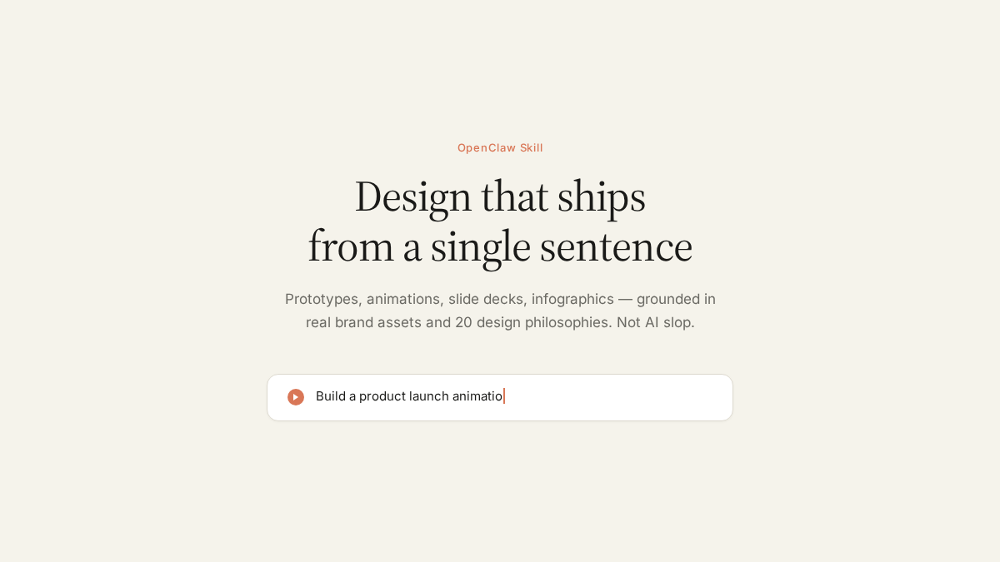

<sub>🌐 <b>English</b> · <a href="README.zh-CN.md">中文</a> · <a href="README.fr.md">Français</a> · <a href="README.de.md">Deutsch</a> · <a href="README.ru.md">Русский</a> · <a href="README.ja.md">日本語</a> · <a href="README.it.md">Italiano</a> · <a href="README.es.md">Español</a></sub>

<div align="center">

# MyClaw Design

> *"Type. Hit enter. A finished design lands in your lap."*

[](https://myclaw.ai)
[](https://github.com/openclaw/openclaw)
[](LICENSE)

<br>

**Say one sentence to your agent. Get back a deliverable design.**

3 to 30 minutes — ship a **product launch animation**, a clickable App prototype, an editable slide deck, or a print-ready infographic. Not "AI-generated-looking" — the kind of work that looks like it came from a real design team.

Give the skill your brand assets (logo, palette, UI screenshots) and it reads your brand DNA. Give it nothing, and 20 built-in design philosophies still keep the output far from AI slop.

</div>

---

<p align="center">
  
</p>

---

## Install

```bash
# Copy to your OpenClaw skills directory
git clone https://github.com/LeoYeAI/myclaw-design.git ~/.openclaw/skills/myclaw-design
```

Then just talk to your agent:

```
"Build a product launch animation for our new feature, suggest 3 style directions"
"Make a clickable iOS prototype — 4 core screens with real navigation"
"Create a 1920×1080 slide deck, export as editable PPTX"
"Turn this logic into a 60-second motion graphic, export MP4 and GIF"
"Run a 5-dimension expert review on this design"
```

No buttons. No panels. No Figma plugins. Just conversation.

---

## Style Gallery

Same content, 6 different design languages — all generated by MyClaw Design from a single prompt:

<table>
<tr>
<td align="center" width="33%"><br><sub>Apple — Pure black, SF Pro, bold numbers</sub></td>
<td align="center" width="33%"><br><sub>Stripe — Deep navy, prismatic gradients</sub></td>
<td align="center" width="33%"><br><sub>Linear — Dark UI, indigo glow, sharp edges</sub></td>
</tr>
<tr>
<td align="center" width="33%"><br><sub>Vercel — Pure black & white, zero color</sub></td>
<td align="center" width="33%"><br><sub>Notion — Warm white, sidebar, database table</sub></td>
<td align="center" width="33%"><br><sub>Claude — Ivory warmth, serif type, terracotta</sub></td>
</tr>
</table>

> Each style is grounded in the real brand's design language — colors extracted from official sites, typography matched, layout patterns faithful to the original. Not generic "dark mode" or "light mode" toggles.

---

## Timeline Animation Demo

A 40-second product showcase — 5 scenes, animated with the built-in Stage + Sprite engine, scored with the `tech` BGM track:

<p align="center">
  
</p>

<p align="center">
  <sub>25fps MP4 (2.8 MB) · 60fps MP4 (2.7 MB) · GIF preview above (4.1 MB) — all generated by the skill's export pipeline</sub>
</p>

> 🎵 The MP4 includes BGM + 26 synced sound effects. **[▶ Watch with sound on GitHub Pages](https://leoyeai.github.io/myclaw-design/)**

### Narrated Brand Video (30s)

TTS narration (Edge TTS) + BGM + SFX — all mixed automatically from declarative `<audio>` tags by `render-seekable.js`:

<p align="center">
  <a href="https://leoyeai.github.io/myclaw-design/">
    
  </a>
</p>

<p align="center">
  <sub><b><a href="https://leoyeai.github.io/myclaw-design/">▶ Watch the narrated demo with sound</a></b> · <a href="docs/myclaw-brand-30s-source.html">View HTML source</a></sub>
</p>

---

## What It Can Do

<p align="center">
  
</p>

| Capability | Deliverable | Typical Time |
|---|---|---|
| **Interactive Prototypes** (App / Web) | Single-file HTML · Real iPhone 15 Pro bezel · Clickable · Playwright-verified | 10–15 min |
| **Timeline Animations** | MP4 (25fps / 60fps interpolated) + GIF (palette-optimized) + BGM + SFX | 8–12 min |
| **Slide Decks** | HTML deck (present in browser) + Editable PPTX (text boxes preserved) | 15–25 min |
| **Design Variants** | 3+ side-by-side comparisons · Live Tweaks · Cross-dimension exploration | 10 min |
| **Infographics** | Print-ready layout · PDF/PNG/SVG export | 10 min |
| **5-Dimension Expert Review** | Radar chart + Keep/Fix/Quick Wins · Actionable fix list | 3 min |

---

## 20 Design Philosophies, Not Generic Defaults

<p align="center">
  
</p>

When requirements are vague, the skill doesn't guess — it consults. From 5 schools × 20 design philosophies, it recommends 3 differentiated directions, generates parallel demos, and lets you choose:

| School | Philosophies | Visual Character |
|---|---|---|
| **Information Architecture** | Pentagram · Müller-Brockmann · Vignelli · Tufte | Rational, data-driven, restrained |
| **Motion Poetics** | Field.io · Refik Anadol · Zach Lieberman · TeamLab | Dynamic, immersive, technical beauty |
| **Minimalism** | Dieter Rams · Build Studio · Jony Ive · Naoto Fukasawa | Order, whitespace, refinement |
| **Experimental Avant-garde** | Sagmeister · Neville Brody · David Carson · Emigre | Provocative, generative, visual impact |
| **Eastern Philosophy** | Kenya Hara · Takram · Muji · Wabi-sabi | Warm, poetic, contemplative |

---

## How It Works

### Brand Asset Protocol

The skill doesn't guess your brand. It follows a strict 5-step protocol:

1. **Ask** — Requests logo, product photos, UI screenshots, color palette, typography
2. **Search** — Crawls official sites, press kits, app stores for assets
3. **Download** — Fetches real files (logo SVG, product hero images, UI screenshots)
4. **Verify** — Checks resolution, transparency, version freshness
5. **Lock** — Writes `brand-spec.md` with all asset paths; CSS variables enforce consistency

> **Why this matters:** Without real brand assets, every AI-generated design looks the same — generic gradients, placeholder icons, zero brand recognition. The protocol costs 30 minutes upfront but saves 1–2 hours of rework.

### Junior Designer Workflow

The skill works like a junior designer reporting to you:

1. **Show assumptions first** — Writes reasoning + placeholders before any code
2. **Get approval** — Waits for your direction before filling in details
3. **Iterate** — Shows progress mid-way, not just the final result
4. **Verify** — Runs Playwright screenshots + console error checks before delivery

### Anti-AI Slop

Every design decision is checked against a strict anti-slop list:

| Avoid | Use Instead |
|---|---|
| Purple gradients | Brand colors / `oklch()` harmonics |
| Emoji as icons | Honest placeholders or real assets |
| Rounded cards + left border accent | Clean boundaries earned by content |
| SVG-drawn faces/objects | Real images or honest placeholders |
| CSS silhouettes replacing product photos | Actual product images from brand protocol |
| Inter/Roboto/system fonts as display | Distinctive display + body font pairing |

---

## Starter Components

Pre-built components you can use immediately:

| Component | Use Case |
|---|---|
| `assets/ios_frame.jsx` | iPhone 15 Pro bezel with Dynamic Island, status bar, Home Indicator |
| `assets/android_frame.jsx` | Android device frame |
| `assets/macos_window.jsx` | macOS window chrome with traffic lights |
| `assets/browser_window.jsx` | Browser window with URL bar + tabs |
| `assets/animations.jsx` | Stage + Sprite + useTime + Easing engine |
| `assets/deck_index.html` | Multi-file slide deck assembler |
| `assets/deck_stage.js` | Single-file slide deck web component |
| `assets/design_canvas.jsx` | Side-by-side variant comparison grid |

## Audio Assets

6 scene-matched BGM tracks + 37 categorized SFX files for production-ready animation output:

- **BGM**: tech / ad / educational / tutorial (+ alt variants)
- **SFX**: keyboard, terminal, transition, impact, magic, feedback, UI, container, progress

---

## Project Structure

```
myclaw-design/
├── SKILL.md              # Core skill instructions (loaded by OpenClaw)
├── assets/               # Starter components, BGM, SFX, showcases
│   ├── *.jsx             # React components (iOS/Android/macOS frames, etc.)
│   ├── bgm-*.mp3         # 6 scene-matched background music tracks
│   ├── sfx/              # 37 categorized sound effects
│   └── showcases/        # 24 pre-built design samples (8 scenes × 3 styles)
├── references/           # Deep-dive guides (loaded on demand)
│   ├── animation-*.md    # Animation best practices + pitfalls
│   ├── design-styles.md  # 20 design philosophies database
│   ├── react-setup.md    # React + Babel technical setup
│   ├── slide-decks.md    # Slide architecture guide
│   ├── video-export.md   # MP4/GIF export pipeline
│   └── ...               # 18 reference files total
└── scripts/              # Automation scripts
    ├── render-video.js   # HTML → MP4 (25fps)
    ├── convert-formats.sh # 60fps interpolation + GIF
    ├── add-music.sh      # BGM + SFX mixing
    ├── export_deck_*.mjs # PDF + PPTX export
    └── verify.py         # Playwright verification
```

---

## Requirements

- [OpenClaw](https://github.com/openclaw/openclaw) (any recent version)
- Node.js ≥ 18 (for scripts)
- [Playwright](https://playwright.dev/) (for verification + video export)
- ffmpeg (for video format conversion + audio mixing)

---

## License

Personal use free. Commercial use requires authorization. See [LICENSE](LICENSE) for details.

---

<div align="center">

**[MyClaw.ai](https://myclaw.ai)** — The AI personal assistant platform that gives every user a full server with complete code control.

</div>
