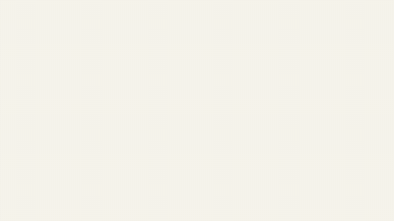
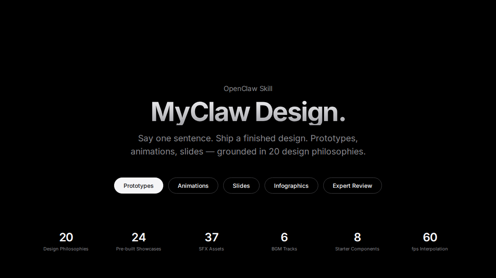
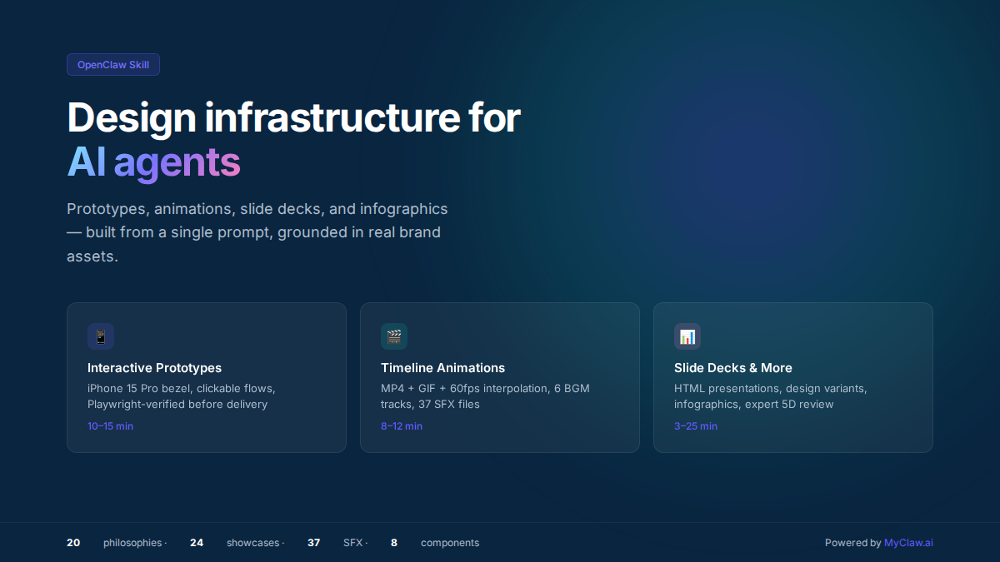
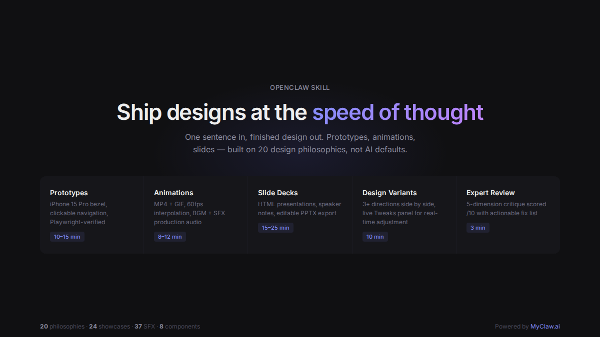
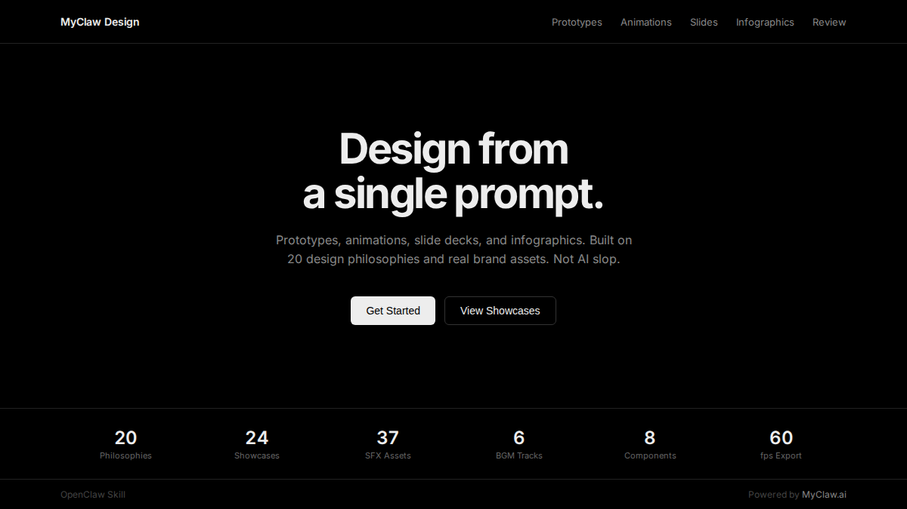
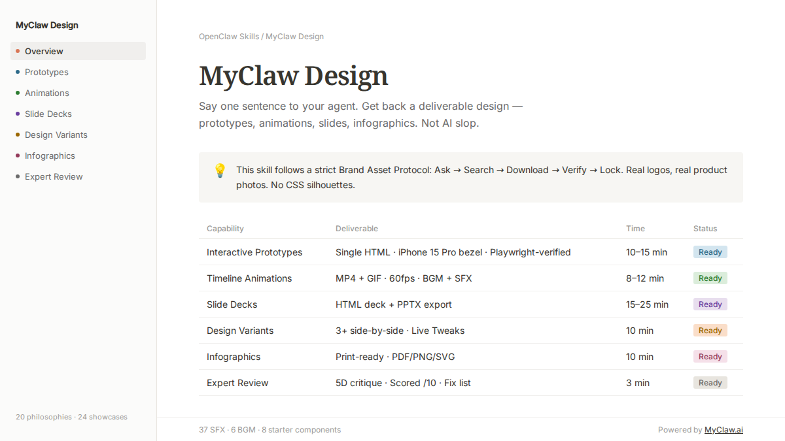
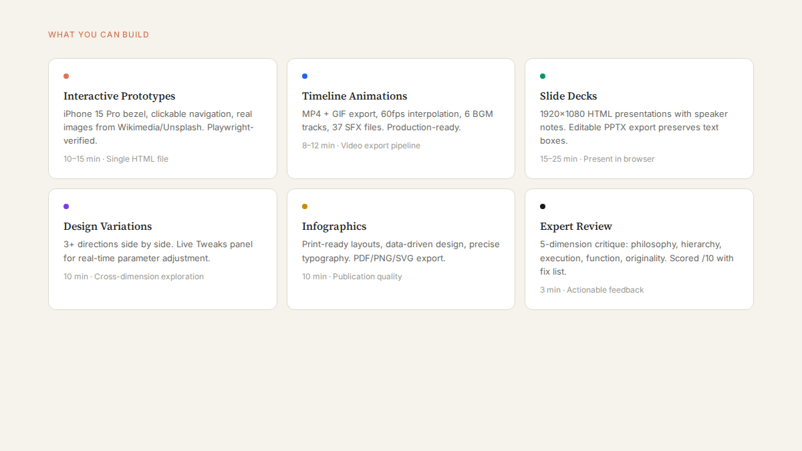
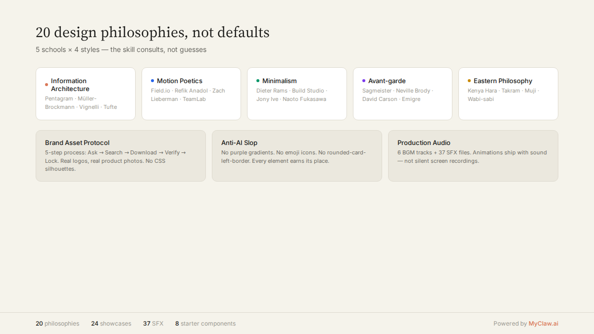

<sub>🌐 <a href="README.md">English</a> · <b>中文</b> · <a href="README.fr.md">Français</a> · <a href="README.de.md">Deutsch</a> · <a href="README.ru.md">Русский</a> · <a href="README.ja.md">日本語</a> · <a href="README.it.md">Italiano</a> · <a href="README.es.md">Español</a></sub>

<div align="center">

# MyClaw Design

> *「打字。回车。一份能交付的设计。」*

[](https://myclaw.ai)
[](https://github.com/openclaw/openclaw)
[](LICENSE)

<br>

**在你的 Agent 里打一句话，拿回一份能交付的设计。**

3 到 30 分钟，你能 ship 一段**产品发布动画**、一个能点击的 App 原型、一套能编辑的 PPT、一份印刷级的信息图。不是「AI 做的还行」那种水平——是看起来像大厂设计团队做的。

给 skill 你的品牌资产（logo、色板、UI 截图），它会读懂你的品牌气质；什么都不给，内置的 20 种设计语汇也能兜底到不出 AI slop。

</div>

---

<p align="center">
  
</p>

---

## 安装

```bash
git clone https://github.com/LeoYeAI/myclaw-design.git ~/.openclaw/skills/myclaw-design
```

然后直接跟 Agent 说话：

```
「做一份 AI 心理学的演讲 PPT，推荐 3 个风格方向让我选」
「做个 AI 番茄钟 iOS 原型，4 个核心屏幕要真能点击」
「把这段逻辑做成 60 秒动画，导出 MP4 和 GIF」
「帮我对这个设计做一个 5 维度评审」
```

没有按钮、没有面板、没有 Figma 插件。

---

## 风格画廊

同样的内容，6 种不同的设计语言——全部由 MyClaw Design 从一句话生成：

<table>
<tr>
<td align="center" width="33%"><br><sub>Apple — 纯黑、大字、极简数据</sub></td>
<td align="center" width="33%"><br><sub>Stripe — 深海蓝、棱镜渐变</sub></td>
<td align="center" width="33%"><br><sub>Linear — 暗色 UI、靛蓝光晕、锐利</sub></td>
</tr>
<tr>
<td align="center" width="33%"><br><sub>Vercel — 纯黑白、零色彩</sub></td>
<td align="center" width="33%"><br><sub>Notion — 暖白、侧边栏、数据库表格</sub></td>
<td align="center" width="33%"><br><sub>Claude — 象牙暖色、衬线字体、赤陶橙</sub></td>
</tr>
</table>

> 每种风格都基于真实品牌的设计语言——颜色从官网提取、字体匹配、布局忠于原作。不是简单的「深色模式」或「浅色模式」切换。

---

## 时间轴动画 Demo

40 秒产品展示动画——5 个场景，用内置 Stage + Sprite 引擎制作，配合 `tech` BGM 音轨：

<p align="center">
  
</p>

<p align="center">
  <sub>25fps MP4 (2.8 MB) · 60fps MP4 (2.7 MB) · GIF 预览如上 (4.1 MB) — 全部由 skill 导出管线生成</sub>
</p>

> 🎵 MP4 版本包含内置 BGM 库的背景音乐（`bgm-tech.mp3`）。下载 MP4 可以听到。

---

## 能做什么

<p align="center">
  
</p>

| 能力 | 交付物 | 典型耗时 |
|---|---|---|
| **交互原型**（App / Web） | 单文件 HTML · 真 iPhone 15 Pro bezel · 可点击 · Playwright 验证 | 10–15 min |
| **时间轴动画** | MP4（25fps / 60fps 插帧）+ GIF（palette 优化）+ BGM + SFX | 8–12 min |
| **演讲幻灯片** | HTML deck（浏览器演讲）+ 可编辑 PPTX（文本框保留） | 15–25 min |
| **设计变体** | 3+ 并排对比 · Tweaks 实时调参 · 跨维度探索 | 10 min |
| **信息图 / 可视化** | 印刷级排版 · 可导 PDF/PNG/SVG | 10 min |
| **5 维度专家评审** | 雷达图 + Keep/Fix/Quick Wins · 可操作修复清单 | 3 min |

---

## 20 种设计哲学，不是通用默认值

<p align="center">
  
</p>

需求模糊时，skill 不猜——它咨询。从 5 流派 × 20 种设计哲学中推荐 3 个差异化方向，并行生成 Demo 让你选：

| 流派 | 哲学 | 视觉气质 |
|---|---|---|
| **信息建筑派** | Pentagram · Müller-Brockmann · Vignelli · Tufte | 理性、数据驱动、克制 |
| **运动诗学派** | Field.io · Refik Anadol · Zach Lieberman · TeamLab | 动感、沉浸、技术美学 |
| **极简主义派** | Dieter Rams · Build Studio · Jony Ive · Naoto Fukasawa | 秩序、留白、精致 |
| **实验先锋派** | Sagmeister · Neville Brody · David Carson · Emigre | 先锋、生成艺术、视觉冲击 |
| **东方哲学派** | Kenya Hara · Takram · Muji · Wabi-sabi | 温润、诗意、思辨 |

---

## 核心机制

### 品牌资产协议

Skill 不猜你的品牌。它遵循严格的 5 步协议：

1. **问** — 逐项索要 logo、产品图、UI 截图、色板、字体
2. **搜** — 爬官网、press kit、应用商店找资产
3. **下载** — 获取真实文件（logo SVG、产品 hero 图、UI 截图）
4. **验证** — 检查分辨率、透明度、版本新鲜度
5. **锁定** — 写入 `brand-spec.md`，CSS 变量强制一致性

### Junior Designer 工作流

Skill 像一个向你汇报的初级设计师：先展示假设 → 等你确认 → 中途展示 → 验证后交付。

### 反 AI Slop

| 避免 | 替代方案 |
|---|---|
| 紫色渐变 | 品牌色 / `oklch()` 和谐色 |
| Emoji 当图标 | 诚实占位符或真实素材 |
| 圆角卡片 + 左 border accent | 由内容决定的干净边界 |
| CSS 剪影代替产品图 | 品牌协议获取的真实产品图 |

---

## 环境要求

- [OpenClaw](https://github.com/openclaw/openclaw)（任意近期版本）
- Node.js ≥ 18 · [Playwright](https://playwright.dev/) · ffmpeg

---

## 许可证

个人使用免费。商业使用需授权。详见 [LICENSE](LICENSE)。

---

<div align="center">

**[MyClaw.ai](https://myclaw.ai)** — 给每个用户一台完整服务器的 AI 个人助理平台。

</div>
